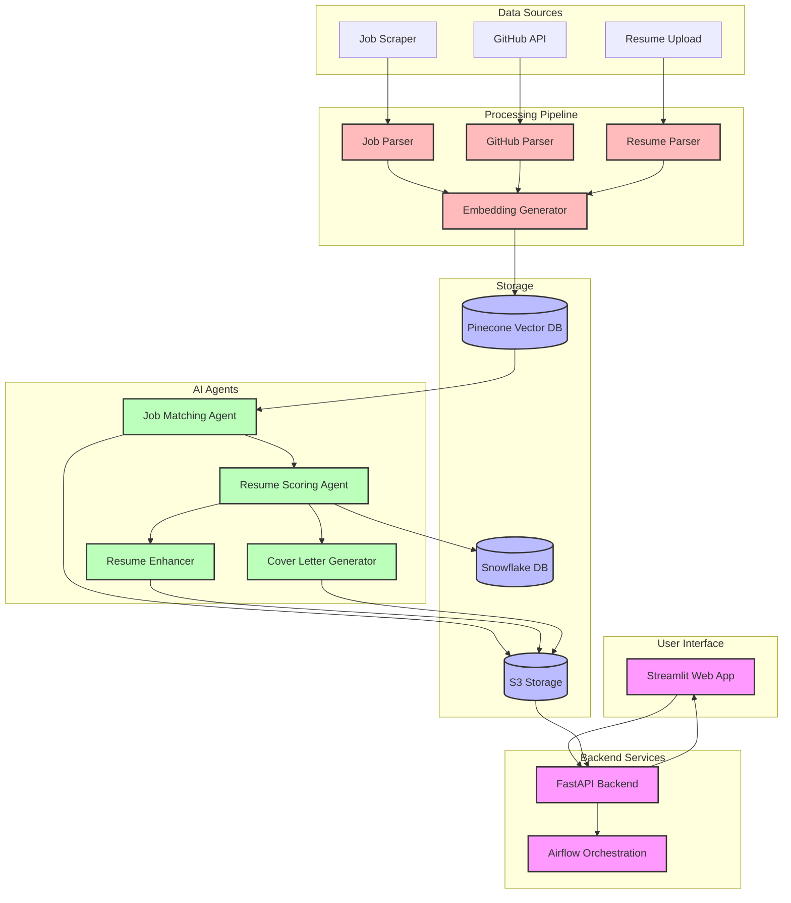

## System Architecture Overview

The SkillMatch AI system consists of several key components working together to provide an intelligent job matching and resume enhancement platform:

1. **User Interface Layer**
   - Streamlit-based web application for user interaction
   - Handles resume uploads and displays results

2. **Backend Services**
   - FastAPI backend for handling API requests
   - Airflow for orchestrating data pipelines

3. **Data Sources**
   - Job scraper for collecting job listings
   - GitHub API integration
   - Resume upload functionality

4. **Processing Pipeline**
   - Job parsing and structuring
   - Resume parsing using LLM
   - GitHub profile analysis
   - Embedding generation for semantic search

5. **Storage Layer**
   - Pinecone for vector storage and similarity search
   - S3 for storing generated documents
   - Snowflake for structured data storage

6. **AI Agents**
   - Job matching agent for finding relevant positions
   - Resume scoring agent for quality assessment
   - Cover letter generator for personalized applications
   - Resume enhancer for improvement suggestions

The system follows a modular architecture where each component has a specific responsibility, making it scalable and maintainable. The use of vector embeddings and LLM-based agents enables sophisticated matching and content generation capabilities. 